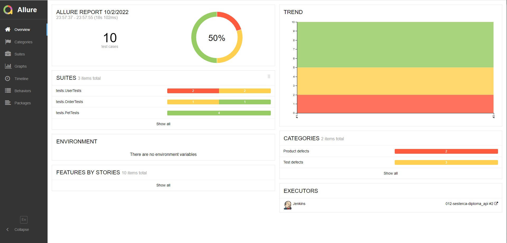
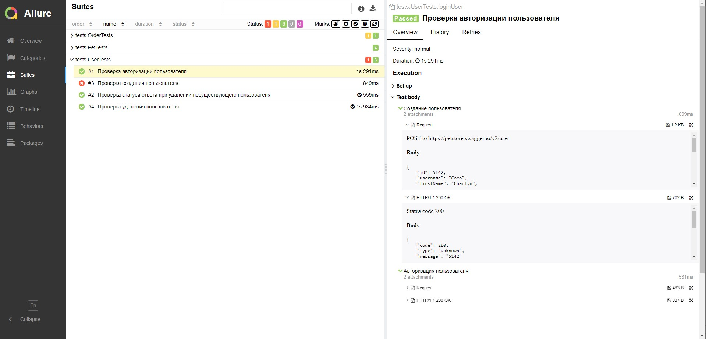
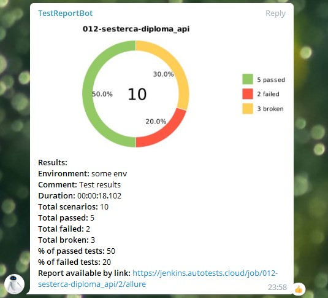

# Тестирование api открытого проекта petstore.swagger.io (магазин домашних животных)

### В проекте реализована :mag_right:
* Проверка создания питомца
* Проверка получения списка всех питомцев
* Проверка создания пользователя
* Проверка авторизации пользователя
* Проверка удаления пользователя
* Проверка удаления несуществующего пользователя
* Проверка оформления заказа на питомца
* Проверка информации о размещенном заказе

### В проекте использованы :gear:


## Для запуска тестов
### удаленно в Jenkins :desktop_computer:
```
gradle clean test
```
[Пример сборки](https://jenkins.autotests.cloud/job/012-sesterca-diploma_api/3/)
Открыть [Jenkins](https://jenkins.autotests.cloud/job/012-sesterca-diploma_api/), в меню слева выбрать ```Собрать с параметрами```


## Для просмотра отчета
Под названием проекта кликнуть []

#### Экраны просмотра отчета о прохождении тестов Allure



## Для уведомления о результатах тестирования

